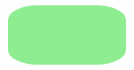
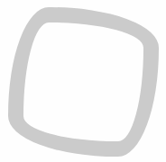
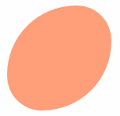
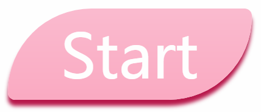
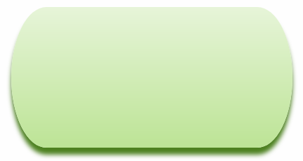
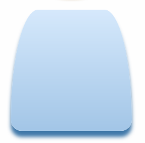
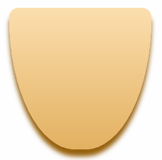
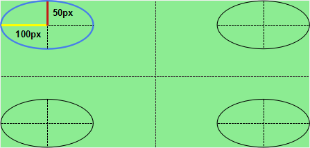

# 有趣的border-radius
## MDN上关于border-radius的介绍
* one,two,three,or four `<length>` or `<percentage>` values. This is used to set a single radius for the coners.
* followed optionally by "/" and one, two, three, or four `<length>` or `<percentage>` values. This is used to set an additional radius, so you can have elliptical corners.

贴心附上链接，请[点击这里](https://developer.mozilla.org/en-US/docs/Web/CSS/border-radius)
## 深度挖掘border-radius
今天我们只关注上面的第二个点，也就是border-radius的八个值

首先来看一下效果（多图预警）：








来几个酷炫的按钮（大图预警）：









这四个按钮不仅用了border-radius还用了box-shadow和linear-gradient

#### 简单回顾一下border-radius的八个值

```
/* 除了长度单位还可以用%表示 */
border-radius: 10px/20px;
border-radius: 10px 20px/20px 10px;
border-radius: 10px 20px 30px/30px 20px 10px;
border-radius: 10px 20px 30px 40px/40px 30px 20px 10px;
```

#### 实现的原理

以下图为例


代码如下
```
border-radius: 100px/50px;
```
大家应该都清楚，上面的代码也是简写形式，完整形式应该如下：
```
border-radius: 100px 100px 100px 100px/50px 50px 50px 50px;
```
我们简单分析一下上面的代码。“/”的左边表示的其实是左上，右上，右下，左下四个角水平方向的半径，而“/”右边表示的左上，右上，右下，左下四个角垂直方向的半径。

由于四个角是类似的，我们以左上角为例，作用原理图如下（图有点丑，没办法，审美有问题，怎么绘制怎么改颜色都不能变好看......）：



**我们用一个水平半径为100px（左上角椭圆中的黄线），垂直半径为50px（左上角椭圆中的红线）的椭圆紧贴左上角（椭圆的上部紧贴矩形的上部，椭圆的右部紧贴矩形的右部）。左上角矩形多余的区域就会被裁剪掉。这是裁剪一个角，如果裁剪四个角就会变成上上图的样子。**

#### 简单练习

* 这是啥图形之我也不知道叫啥


代码如下：

```
border-radius: 100% 50%/0 100%;
```

* 一片叶子


代码如下：

```
border-radius: 0 100%/0 100%;
```

* 倾斜的椭圆


代码如下：

```
border-radius: 100% 50%/100% 50%;
```

* 扭曲的相框


代码如下：

```
border-radius: 150px 400px 150px 400px/400px 150px 400px 150px;
```

#### 酷炫按钮练习

* 


代码如下（包含渐变和阴影）：

```
background: linear-gradient(to bottom,#FBBCD0,#FBAAC3);
box-shadow: 0 10px 10px #B9174C;
border-radius: 150px 14px/150px 14px;
```

*


代码如下（包含渐变和阴影）：

```
background: linear-gradient(to bottom,#E8F6D9,#BEE595);
box-shadow: 0 10px 10px #4F821D;
border-radius: 50px/100px;
```

*


代码如下（包含渐变和阴影）：

```
background: linear-gradient(to bottom,#D7EAFD,#A3C7E8);
box-shadow: 0 10px 10px #4179AB;
border-radius: 50px 50px 20px 20px/200px 200px 20px 20px;
```

*


代码如下（包含渐变和阴影）：

```
background: linear-gradient(to bottom,#FDE0AF,#E4B260);
border-radius: 15px 15px 50% 50%/15px 15px 100% 100%;
box-shadow: 0 10px 10px #986206;
```

## 总结

其实你只要看懂了上面的原理图，关于border-radius就可以算是理解了。剩下的就是发挥你的创造力去制作出不同效果的图形，可以结合渐变和阴影制作出很漂亮的图形。

#### 额外收获

在研究border-radius的时候竟然收获到了如何用 DIV 来模拟梯形，学习处处有惊喜！


![梯形](./img/img06
